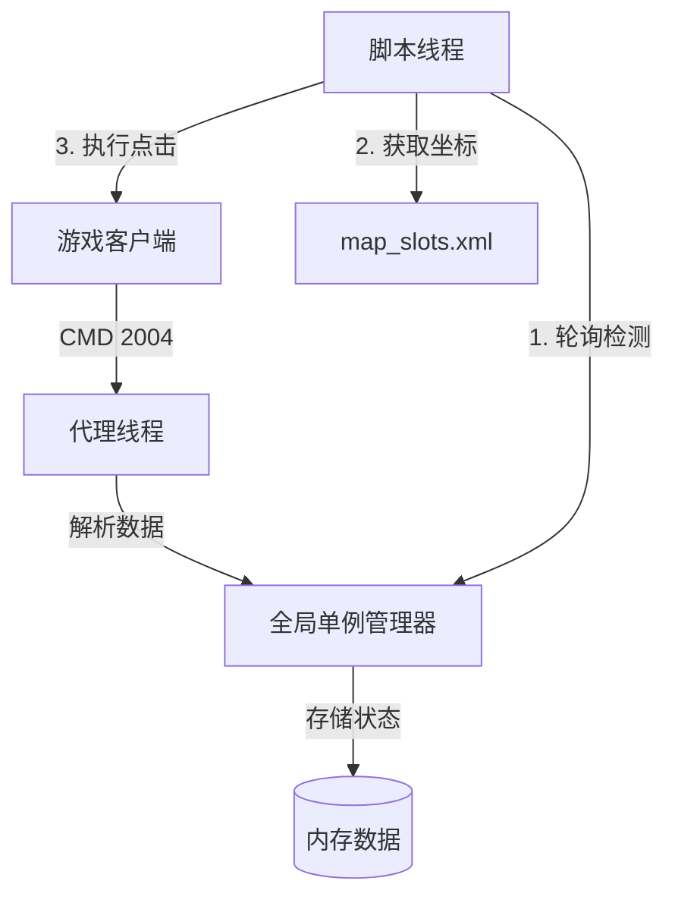

# 异色精灵捕捉系统重构总结 (Refactor Summary)

## 1. 重构背景与目标

**原有痛点**:
- 依赖 **音频检测** 和 **图像识别**，受环境音、遮挡、渲染速度影响，存在误判和漏抓。
- 无法精准定位精灵的具体槽位，只能通过模糊匹配。

**重构目标**:
- 引入 **协议级检测 (Protocol Detection)**，直接解析游戏服务端下发的精灵数据。
- 实现 **100% 准确率** 的异色判断。
- 依然保留原有的图像/音频逻辑作为兜底或混合模式。

## 2. 系统架构 (Architecture)

采用 **"进程内内存共享 (In-Process Memory)"** 方案，Proxy 与 Bot 运行在同一个进程的不同线程中，数据实时互通。



### 核心组件

| 组件 | 路径 | 功能描述 |
| :--- | :--- | :--- |
| **OgreManager** | `core/ogre_manager.py` | **核心桥梁**。线程安全的单例，负责接收 Proxy 的数据写入，并向 Bot 提供查询接口。同时负责加载坐标配置文件。 |
| **ProxyThread** | `threads/proxy_thread.py` | **后台服务**。在 GUI 启动时运行，基于 `WinDivert` 拦截网络包，不阻塞主界面。 |
| **Cmd Handler** | `proxy/handlers/cmd_2004_ogre.py` | **数据解析**。解析 `CMD 2004` (地图精灵列表)，提取槽位 ID 和异色状态 (is_shiny)。 |
| **Config** | `proxy/data/map_slots.xml` | **静态配置**。定义了每个地图 ID 下，0-8 号槽位对应的屏幕坐标 (x, y)。 |

## 3. 具体实现细节

### 3.1 协议解析 (Proxy Side)
- 监听 `CMD 2004` (Map Ogre List)。
- 解析包体，遍历 9 个槽位。
- 提取 `IsShiny` 字段 (Uint32)。
- 调用 `OgreManager().update_slots(data)` 将当前地图的精灵状态写入内存。

### 3.2 坐标映射 (Config Side)
配置文件 `proxy/data/map_slots.xml` 支持多地图配置：
```xml
<MapSlots id="10"> <!-- 克洛斯星 -->
    <Slot id="0" x="100" y="200" />
    <Slot id="1" x="250" y="300" />
    <!-- ... -->
</MapSlots>
```

### 3.3 捕捉逻辑 (Bot Side)
在 `shinyCatcher` 中新增了 `check_protocol_shiny()` 方法，并在主循环首位调用：
1. 从 `SHINY_CONFIG` 读取目标精灵的 `map_id` (如 10)。
2. 调用 `OgreManager().get_shiny_targets(map_id)`。
3. Manager 查找内存中 `is_shiny=True` 的槽位索引 (如 Slot 1)。
4. Manager 查找 XML 中 `Map 10` -> `Slot 1` 的坐标 (250, 300)。
5. Bot 直接点击该坐标，无需图像识别。

## 4. 使用说明与配置

### 4.1 环境要求
- 必须以 **管理员身份** 运行程序 (依赖 WinDivert)。
- 确保 `proxy/data/map_slots.xml` 存在且坐标已针对当前分辨率校准。

### 4.2 添加新精灵配置
若要支持新地图的异色捕捉，需执行两步：

1.  **修改 `config/config.py`**:
    在 `SHINY_CONFIG` 中添加 `map_id` 字段。
    ```python
    "皮皮": {
        "map_id": 10,  # 新增：指定地图ID
        "normal_pet": ["皮皮"],
        "shiny_pet": ["闪光皮皮"],
        # ...
    }
    ```

2.  **修改 `proxy/data/map_slots.xml`**:
    添加对应地图 ID 的槽位坐标。
    ```xml
    <MapSlots id="10">
        <Slot id="0" x="..." y="..." />
        <!-- 填满 0-8 号槽位 -->
    </MapSlots>
    ```

## 5. 优势总结

1.  **极速响应**: 毫秒级感知异色刷新，优于视觉识别。
2.  **抗干扰**: 即使游戏静音、窗口被遮挡，依然能精准点击目标。
3.  **零 IO 开销**: 纯内存数据交换，无文件读写损耗。
