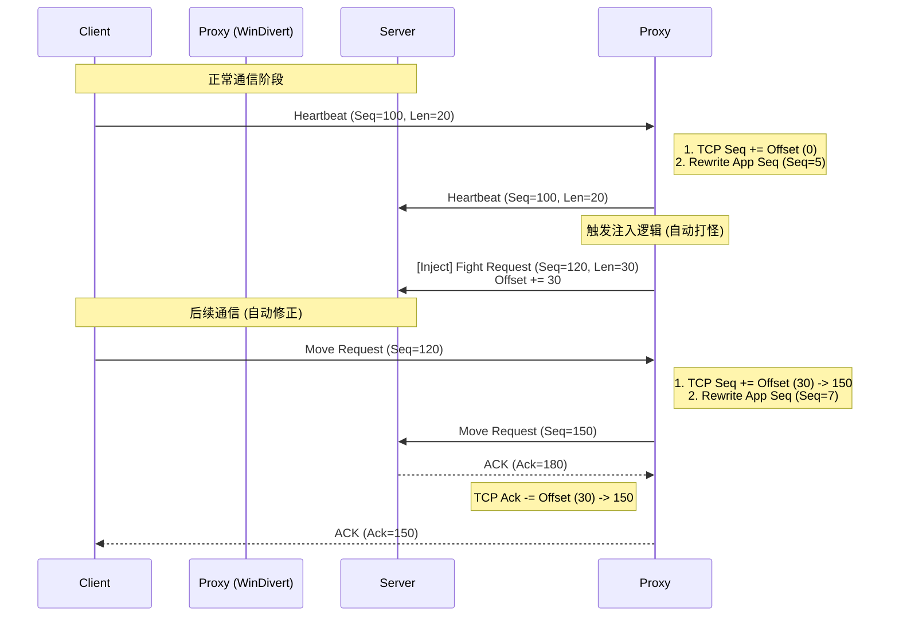

# 赛尔号协议中间人：序列号重写与主动注入技术文档

## 1. 概述
本项目通过 Python `pydivert` 库实现了一个基于 Windows 内核驱动 (WinDivert) 的透明代理。为了在不修改客户端代码的前提下实现**自动化操作（如自动打怪）**，我们必须解决两个核心网络难题：
1.  **应用层序列号同步**：游戏协议中包含严格递增的 `Sequence Number` (Result 字段)。
2.  **网络层 TCP 注入**：在 TCP 连接中插入自定义数据包而不引起连接断开。

## 2. 核心机制

### 2.1 应用层序列号接管 (Application Layer Sequence Hijacking)
游戏客户端自行维护一个序列号计数器，每次发包 +1。如果我们直接发包，会导致服务器收到乱序的号码，或导致客户端后续发包被服务器拒绝。

**解决方案：**
代理服务器接管序列号的维护权。
*   **状态维护**：在内存中维护 `current_sequence`。
*   **重置时机**：监听 `CMD 1001` (登录相关) 数据包（Client -> Server），一旦捕获，将 `current_sequence` 重置为 0。
*   **强制重写**：对于**所有**经过代理的 Client -> Server 数据包，无视客户端原本填写的序列号，**强制覆盖**为代理维护的 `current_sequence`，然后计数器 +1。

### 2.2 TCP 流量注入与修正 (TCP Injection & Correction)
为了实现“主动发包”（如自动发起战斗），我们不能简单地调用 Socket 发送，因为这会破坏原有的 TCP 状态机（SEQ/ACK 号错乱），导致掉线。

**解决方案：TCP 序列号动态补偿 (Seq/Ack Offloading)**
我们采用“寄生注入”策略，并动态维护一个 TCP 偏移量 (`seq_offset`)。

#### 2.2.1 注入原理 (Injection)
我们不凭空创建 TCP 连接，而是利用现有的客户端流量作为“载体”。
1.  **等待时机**：程序阻塞等待任意一个合法的客户端上行数据包（如心跳包 CMD 1002）。
2.  **克隆与构造**：
    *   捕获该数据包 (`last_packet`)。
    *   将其作为模板，保留 IP/TCP 头部信息（确保源端口、窗口大小等合法）。
    *   计算新包的 `SEQ` = `last_packet.SEQ` + `last_packet.Len`。
    *   填充自定义的游戏协议数据（如 CMD 2408）。
3.  **立即发送**：在转发完原包后，紧接着发送构造好的注入包。
4.  **更新偏移**：`self.seq_offset += len(injected_payload)`。

#### 2.2.2 流量修正 (Correction)
由于我们插入了额外数据，服务器看到的 SEQ 比客户端实际发出的要大。为防止双方“对不上账”，代理必须对后续所有流量进行修正：

*   **上行 (Client -> Server)**:
    *   `Packet.Seq += seq_offset`
    *   (欺骗服务器：这些包是紧跟着注入包后面发的)
*   **下行 (Server -> Client)**:
    *   `Packet.Ack -= seq_offset`
    *   (欺骗客户端：服务器没收到那么多数据，你不用管那些注入的包)

## 3. 模块架构

### 3.1 核心类 `SeerProxy` (`src/proxy.py`)
*   **`handle_packet(packet, w)`**: 主处理循环。
    *   优先执行 TCP SEQ/ACK 修正。
    *   解析 WebSocket/游戏协议。
    *   执行序列号重写。
    *   调用 `check_and_inject`。
*   **`check_and_inject(packet, w)`**: 注入逻辑。
    *   检查 `CommandQueue`。
    *   执行包克隆、SEQ 计算、发送、偏移量更新。

### 3.2 指令队列 `CommandQueue` (`src/utils/command_queue.py`)
*   线程安全的单例队列。
*   业务逻辑（如 `cmd_2004_ogre.py`）调用 `send_packet()` 将指令放入此队列，解耦了业务层与网络层。

### 3.3 协议解析与事件分发
*   **`src/handlers/cmd_2004_ogre.py`**: 监听地图刷怪包，自动决策并调用 `send_packet` 触发战斗。
*   **`src/config.py`**: 控制开关 `ENABLE_SEQUENCE_REWRITE`。

## 4. 数据流向图

## 5. 局限性与依赖
*   **依赖流量**：注入机制依赖于客户端必须有上行流量（哪怕是心跳包）才能触发。如果客户端完全断网或静默，注入将暂停。
*   **性能消耗**：Python 处理每个包增加了微小的延迟，但在 RPG 游戏中可忽略不计。
*   **权限**：必须以管理员权限运行以加载 WinDivert 驱动。
